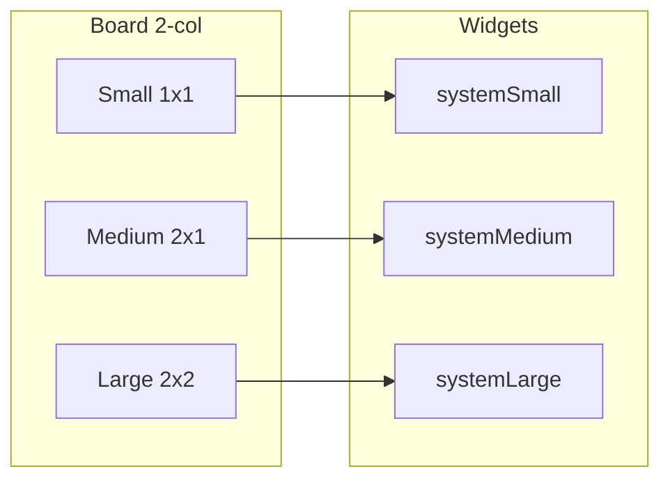

# Sticky Note Sizing

## Context

Sticky notes have three discrete sizes that mirror widget families. Size is chosen from the board's view type and size constraints on ContentView; Widget from widget config. The board should preview the same “paper” the widget will show.

Summary table lives in [design-doc-1.md](/design-doc-1.md) under Sticky Note.

## Recommendation

Use **fixed note footprints** and **fixed height with truncate with fade**. Do not use variable-height cells.

Variable height fights discrete S/M/L and “fonts relative to size”: size becomes “how much you typed,” a 2-column board gets ragged rows, and the widget cannot grow with content—board and widget diverge.

## Geometry (adaptive)

Not hard-coded to one phone width:

- Horizontal inset: 16pt; inter-item: 12pt
- `half = (contentWidth - 12) / 2`
- **Small:** `width = half`, `height = half`
- **Medium:** `width = contentWidth`, `height = half` (same height as small → clean rows)
- **Large:** `width = contentWidth`, `height = contentWidth` (or `2 * half + 12` so it sits as a 2×2 block)

On ~~393pt-wide phones that lands near **~~174×174 / ~361×174 / ~361×361**—close enough to small / medium / large widget proportions without matching widget points 1:1 (Home Screen chrome differs).

## List vs 2-column

- **Primary board:** 2-column grid with the spans above (pinboard, widget-aligned).
- **Optional compact list:** same three fixed heights at **full width** (small becomes a short full-width bar, or list shows only medium/large). Do **not** use variable height in either mode.
- Overflow: truncate with fade or scroll **inside** the note; do not grow the cell.

## Why not variable height

- Breaks discrete S/M/L and “fonts relative to size”
- Uneven 2-col rows; masonry is out of scope for LazyVGrid + per-cell drop
- Widget cannot grow with content—board and widget diverge

## Type scale

Body text relative to size (starting point; tune in UI):

| Size   | Body |
| ------ | ---- |
| Small  | 14pt |
| Medium | 16pt |
| Large  | 18pt |

